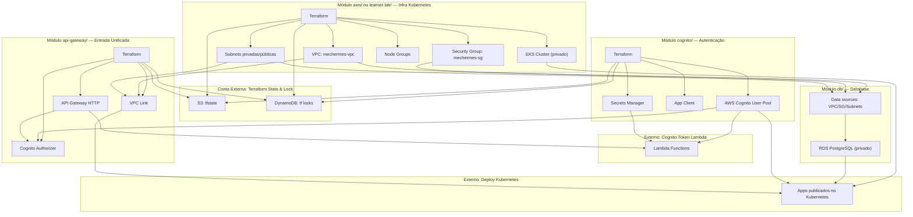

# Mecânica Hermes - Infraestrutura AWS

Este repositório centraliza o provisionamento da infraestrutura AWS da plataforma Mecânica Hermes.
Os módulos Terraform deste projeto cobrem VPC/EKS, Cognito, Database (RDS) e API Gateway.

---

## Tecnologias Utilizadas


- **Terraform** para provisionamento de infraestrutura como código (IaC)
- **AWS** como provedor de nuvem
- **VPC, Subnets e Security Groups** para rede e segurança
- **Amazon EKS** para o cluster Kubernetes
- **Amazon RDS** para banco de dados PostgreSQL
- **S3** para armazenamento do estado do Terraform
- **DynamoDB** para lock de estado do Terraform
- **Cognito** para provisionar a infraestrutura de autenticação OAuth2 para a aplicação
- **API Gateway** como ponto de entrada unificado com autenticação Cognito e integração com Lambda e API backend
- **GitHub Actions** para execução da pipeline.

---

## Arquitetura dos Projetos de Infra

Nossa infraestrutura para disponibilizar um ambiente completo e funcional é composta por seis passos sequenciais executados em diferentes repositórios/módulos:

1. Mecânica Hermes - Infra Kubernetes (Este projeto - módulo `aws/` ou `learner-lab/`)
2. Mecânica Hermes - Infra Cognito (Este projeto - módulo `cognito/`)
3. Mecânica Hermes - Infra Database (Este projeto - módulo `db/`)
4. [Mecânica Hermes - Deploy Kubernetes](https://github.com/fiap-challenge-13soat/mecanica-hermes-k8s)
5. [Mecânica Hermes - Cognito Token Lambda](https://github.com/fiap-challenge-13soat/mecanica-hermes-lambda)
6. Mecânica Hermes - API Gateway (Este projeto - módulo `api-gateway/`)

---



## Execução pela Pipeline

### Workflows disponíveis

| Fluxo | Workflow |
| --- | --- |
| Criar infraestrutura base (learner lab) | `Learner Lab AWS - Terraform Create` |
| Destruir infraestrutura base (learner lab) | `Learner Lab AWS - Terraform Destroy` |
| Criar infraestrutura base (AWS admin) | `AWS - Terraform Create` |
| Destruir infraestrutura base (AWS admin) | `AWS - Terraform Destroy` |
| Criar/atualizar Cognito | `Cognito - Terraform Create` |
| Destruir Cognito | `Cognito - Terraform Destroy` |
| Criar/atualizar Database | `Database - Terraform Create` |
| Destruir Database | `Database - Terraform Destroy` |
| Criar/atualizar API Gateway | `API Gateway - Terraform Create` |
| Destruir API Gateway | `API Gateway - Terraform Destroy` |

### Secrets e variáveis necessárias

| Tipo | Nome | Uso |
| --- | --- | --- |
| Secret | `AWS_ACCESS_KEY_ID` | Autenticação AWS nos workflows |
| Secret | `AWS_SECRET_ACCESS_KEY` | Autenticação AWS nos workflows |
| Secret | `AWS_SESSION_TOKEN` | Sessão temporária (quando aplicável) |
| Secret | `AWS_ACCOUNT_ID` | Exigido nos workflows de `learner-lab` |
| Variável | `AWS_DEFAULT_REGION` | Região alvo da AWS |

### Ordem recomendada de execução

1. `Learner Lab AWS - Terraform Create` **ou** `AWS - Terraform Create`
2. `Cognito - Terraform Create` (input `environment`: `hml` ou `prd`)
3. `Database - Terraform Create` (input `environment`: `hml` ou `prd`)
4. Deploy da API no repositório `mecanica-hermes-k8s`
5. Deploy da Lambda no repositório `mecanica-hermes-lambda`
6. `API Gateway - Terraform Create`

> **Atenção:** para destruir o ambiente, faça o caminho inverso. O deploy do Kubernetes deve ser destruído antes da infraestrutura base para evitar recursos órfãos (NLB, Security Groups e VPC Links).

---

## Execução Local

Abordaremos os passos para realizar a criação de infraestrutura em ambiente AWS partindo do seu computador.

---

### Configuração da AWS

Realize o comando abaixo e forneça suas credenciais.

```bash
aws configure
```

---

### Criação do bucket para o terraform state

Caso ainda não exista, crie o bucket destinado a armazenar o arquivo do terraform state.

```bash
aws s3api create-bucket --bucket mechermes-tf-state-aws --region us-east-1
```

---

### Criação da tabela no DynamoDB para o terraform lock

Caso ainda não exista, crie a tabela destinado a controlar o lock do terraform.

```bash
aws dynamodb create-table --table-name mechermes-tf-locks --attribute-definitions AttributeName=LockID,AttributeType=S --key-schema AttributeName=LockID,KeyType=HASH --provisioned-throughput ReadCapacityUnits=5,WriteCapacityUnits=5 --region us-east-1 || echo "Tabela já existe"
```

---

### Deploy do Terraform no AWS Learner Lab

Confira o [README.md](./learner-lab/README.md) com maiores detalhes para este deploy.

**Recursos provisionados:**

- VPC com sub-redes públicas, privadas e de banco de dados
- NAT Gateway para acesso à internet das sub-redes privadas
- EKS Cluster (Kubernetes 1.34) com Node Groups (`t3.small`)
- Security Groups para comunicação entre EKS, RDS e Lambda
- Configuração específica para roles `LabRole` e `voclabs` do AWS Academy

**Quick Start:** Veja o [QUICK-START.md](./learner-lab/QUICK-START.md) para deploy rápido em minutos.

---

### Deploy do Terraform no AWS com usuário admin

Confira o [README.md](./aws/README.md) com maiores detalhes para este deploy.

**Recursos provisionados:**

- VPC com sub-redes públicas, privadas e de banco de dados
- NAT Gateway para acesso à internet das sub-redes privadas
- EKS Cluster (Kubernetes 1.34) com Node Groups (`t3.small`)
- Security Groups para comunicação entre EKS, RDS e Lambda
- Roles IAM criadas automaticamente pelo EKS

**Quick Start:** Veja o [QUICK-START.md](./aws/QUICK-START.md) para deploy rápido em minutos.

---

### Deploy do Cognito (Autenticação e Autorização)

Confira o [README.md](./cognito/README.md) com maiores detalhes para este deploy.

**Recursos provisionados:**

- AWS Cognito User Pool
- App Client com suporte a `client_credentials` flow
- Resource Server com scopes customizados (`mechermes/admin`, `mechermes/client`)
- Cognito Domain para endpoints OAuth2
- AWS Secrets Manager para armazenamento seguro de credenciais

**Quick Start:** Veja o [QUICK-START.md](./cognito/QUICK-START.md) para deploy rápido em minutos.

---

### Deploy do Database (RDS PostgreSQL)

O módulo `db/` provisiona instâncias Amazon RDS PostgreSQL para os ambientes `hml` e `prd`, reutilizando recursos de rede (VPC, Security Group e DB Subnet Group) criados pelo módulo `aws/`.

**Recursos provisionados:**

- Amazon RDS PostgreSQL 17.6 (`db.t4g.micro`)
- Criptografia de storage habilitada
- Backup com retenção de 7 dias
- Snapshot final ao destruir
- Acesso restrito à VPC (sem acesso público)

**Quick Start:** Veja o [QUICK-START.md](./db/QUICK-START.md) para deploy rápido em minutos.

---

### Deploy do API Gateway (Ponto de Entrada Unificado)

Confira o [README.md](./api-gateway/README.md) com maiores detalhes para este deploy.

**Recursos provisionados:**

- AWS API Gateway HTTP API com Cognito Authorizer
- VPC Link para integração privada com o backend EKS
- Lambda Integration para endpoint de geração de tokens
- Rotas configuradas com autenticação JWT
- CloudWatch Logs para observabilidade

**Quick Start:** Veja o [QUICK-START.md](./api-gateway/QUICK-START.md) para deploy rápido em minutos.

---

## Documentação rica

- [Arquitetura do repositório](./docs/Arquitetura.md)
- [RFCs](./docs/RFCs.md)
- [ADRs](./docs/ADRs.md)

### Guias por módulo

| Módulo | README | Quick Start |
| --- | --- | --- |
| `aws/` | [README.md](./aws/README.md) | [QUICK-START.md](./aws/QUICK-START.md) |
| `learner-lab/` | [README.md](./learner-lab/README.md) | [QUICK-START.md](./learner-lab/QUICK-START.md) |
| `cognito/` | [README.md](./cognito/README.md) | [QUICK-START.md](./cognito/QUICK-START.md) |
| `db/` | [README.md](./db/README.md) | [QUICK-START.md](./db/QUICK-START.md) |
| `api-gateway/` | [README.md](./api-gateway/README.md) | [QUICK-START.md](./api-gateway/QUICK-START.md) |
