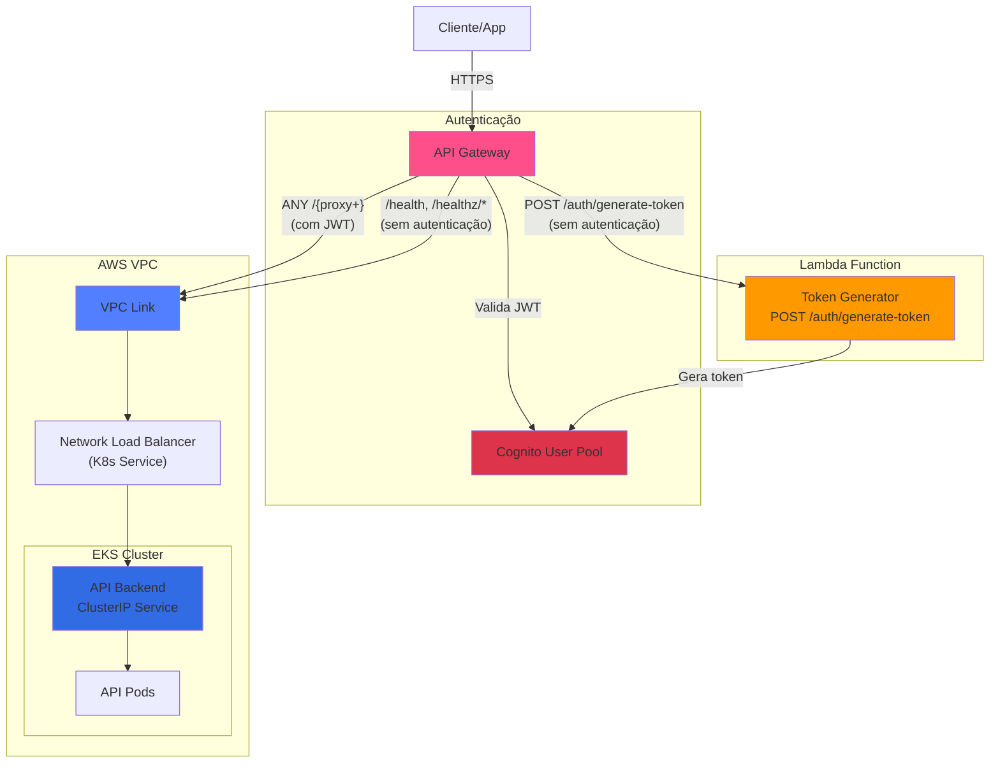

# Módulo `api-gateway/` — Ponto de Entrada Unificado (API Gateway)

Este módulo Terraform gerencia o AWS API Gateway HTTP que atua como ponto de entrada unificado para a aplicação Mecânica Hermes, integrando autenticação via Cognito, função Lambda para geração de tokens e o backend da API no EKS.

## Recursos provisionados

- **HTTP API** com suporte a CORS e logs no CloudWatch
- **Cognito Authorizer** — autenticação JWT usando Cognito User Pool
- **Lambda Integration** — `POST /auth/generate-token` (público)
- **VPC Link Integration** — proxy reverso para o backend EKS via NLB (JWT obrigatório)
- **Security Group** para comunicação com o NLB nas subnets privadas

## Arquitetura

## Rotas configuradas

| Rota | Método | Autenticação | Destino |
| --- | --- | --- | --- |
| `/auth/generate-token` | POST | Não | Lambda |
| `/{proxy+}` | ANY | JWT | API Backend |
| `/health` | GET | Não | API Backend |
| `/healthz/live` | GET | Não | API Backend |
| `/healthz/ready` | GET | Não | API Backend |

## Pré-requisitos

Antes de executar este módulo, os seguintes recursos devem existir:

1. VPC e Subnets (via `aws/` ou `learner-lab/`)
2. EKS Cluster (via `aws/` ou `learner-lab/`)
3. Cognito User Pool (via `cognito/`)
4. Lambda Function (via repositório `mecanica-hermes-lambda`)
5. API Backend deployado no K8s com serviço NLB (via repositório `mecanica-hermes-k8s`)

> O módulo utiliza **data sources** para descobrir automaticamente VPC, subnets, EKS e NLB. Você só precisa fornecer o ARN do Cognito User Pool e da Lambda.

## Variáveis necessárias

| Variável | Descrição | Default |
| --- | --- | --- |
| `project_name` | Nome base para todos os recursos | `mechermes` |
| `environment` | Nome do ambiente (`hml` ou `prd`) | `hml` |

> Os arquivos `hml.tfvars` e `prd.tfvars` já estão configurados com os valores padrão.

## Secrets (GitHub Actions)

| Secret | Descrição |
| --- | --- |
| `AWS_ACCESS_KEY_ID` | Chave de acesso AWS |
| `AWS_SECRET_ACCESS_KEY` | Chave secreta AWS |
| `AWS_SESSION_TOKEN` | Token de sessão AWS |

## Execução via GitHub Actions

1. Acesse **Actions** no repositório `mecanica-hermes-infra`
2. Execute o workflow **`API Gateway - Terraform Create`**
3. Informe o ambiente (`hml` ou `prd`)
4. Aguarde a conclusão (~8-10 minutos)

## Execução local

Para passos rápidos de deploy local e via GitHub Actions, consulte o [QUICK-START.md](./QUICK-START.md).

## Destruir recursos

1. Via GitHub Actions: execute o workflow **`API Gateway - Terraform Destroy`** (informe `hml` ou `prd`).
2. Via CLI: consulte o [QUICK-START.md](./QUICK-START.md#destruir-recursos).

> **Atenção:** o API Gateway deve ser o primeiro recurso a ser destruído ao desfazer o ambiente.

## Troubleshooting

### Erro: "Unauthorized"

**Causa:** token JWT inválido ou expirado.

**Solução:** gere um novo token via `POST /auth/generate-token`.

### Erro: "VPC Link not available"

**Causa:** VPC Link ainda está sendo criado.

**Solução:** aguarde alguns minutos. VPC Links podem levar até 10 minutos.

### Erro: "Integration timed out"

**Causa:** backend não está respondendo.

**Solução:** verifique se os pods estão rodando (`kubectl get pods -n mecanica-hermes-hml`), se o NLB está healthy e se os security groups estão corretos.

## Referências

- [AWS API Gateway HTTP APIs](https://docs.aws.amazon.com/apigateway/latest/developerguide/http-api.html)
- [VPC Links for HTTP APIs](https://docs.aws.amazon.com/apigateway/latest/developerguide/http-api-vpc-links.html)
- [JWT Authorizers](https://docs.aws.amazon.com/apigateway/latest/developerguide/http-api-jwt-authorizer.html)
- [Terraform AWS API Gateway v2](https://registry.terraform.io/providers/hashicorp/aws/latest/docs/resources/apigatewayv2_api)
- [README principal](../README.md)
