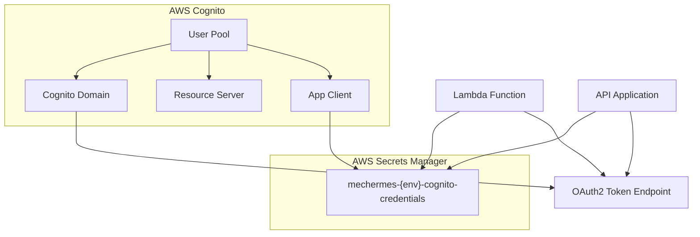

# Módulo `cognito/` — Autenticação e Autorização (Cognito)

Este módulo Terraform gerencia a infraestrutura do AWS Cognito para autenticação e autorização da aplicação Mecânica Hermes.


## Recursos provisionados

- **User Pool** com domínio Cognito para endpoints OAuth2
- **User Pool Client** com suporte a `client_credentials` flow
- **Resource Server** com scopes customizados (`mechermes/admin`, `mechermes/client`)
- **Secrets Manager** — armazenamento seguro do `client_id` e `client_secret`

## Arquitetura



## Pré-requisitos

Consulte o [`README.md`](../README.md) principal do repositório para configuração de credenciais e backend remoto.

## Variáveis necessárias

| Variável | Descrição | Default |
| --- | --- | --- |
| `project_name` | Nome base para todos os recursos | `mechermes` |
| `environment` | Nome do ambiente (`hml` ou `prd`) | `hml` |

> Os arquivos `hml.tfvars` e `prd.tfvars` já estão configurados. Todos os valores são gerados automaticamente a partir de `project_name` e `environment`.

## Secrets (GitHub Actions)

| Secret | Descrição |
| --- | --- |
| `AWS_ACCESS_KEY_ID` | Chave de acesso AWS |
| `AWS_SECRET_ACCESS_KEY` | Chave secreta AWS |
| `AWS_SESSION_TOKEN` | Token de sessão AWS |

## Execução via GitHub Actions

1. Acesse **Actions** no repositório `mecanica-hermes-infra`
2. Execute o workflow **`Cognito - Terraform Create`**
3. Informe o ambiente (`hml` ou `prd`)
4. Aguarde a conclusão e valide os outputs no resumo da execução

## Execução local

Para passos rápidos de deploy local e via GitHub Actions, consulte o [QUICK-START.md](./QUICK-START.md).

## Outputs

| Output | Descrição |
| --- | --- |
| `cognito_user_pool_id` | ID do User Pool |
| `cognito_user_pool_arn` | ARN do User Pool |
| `cognito_client_id` | ID do App Client |
| `cognito_domain` | Prefixo do domínio Cognito |
| `cognito_token_endpoint` | URL do endpoint OAuth2 token |
| `cognito_scopes` | Lista de scopes disponíveis |
| `cognito_secret_arn` | ARN do secret no Secrets Manager |
| `cognito_secret_name` | Nome do secret no Secrets Manager |

## Consumo por aplicações

As aplicações consumidoras devem:

1. Ler o secret do Secrets Manager usando `cognito_secret_name`
2. Extrair `client_id` e `client_secret` do JSON
3. Solicitar token no endpoint OAuth2 com `grant_type=client_credentials`

```bash
COGNITO_SECRET_ID=mechermes-hml-cognito-credentials
```

> **Nota:** o repositório `mecanica-hermes-lambda` cria/atualiza um secret adicional (`mechermes-{env}-cognito-client-secret`) que consolida credenciais do Cognito e senha do banco.

## Destruir recursos

1. Via GitHub Actions: execute o workflow **`Cognito - Terraform Destroy`** (informe `hml` ou `prd`).
2. Via CLI: consulte o [QUICK-START.md](./QUICK-START.md).

> **Atenção:** destrua o API Gateway antes de destruir o Cognito.

## Troubleshooting

### Erro: Resource already exists

**Causa:** recurso Cognito já existe na conta AWS.

**Solução:** importe o recurso existente para o estado do Terraform com `terraform import`.

### Erro: Domain already exists

**Causa:** domínio Cognito é globalmente único.

**Solução:** confirme o prefixo de domínio em uso e ajuste a variável se necessário.

### Erro: Client secret not accessible

**Causa:** permissões IAM insuficientes para acessar o Secrets Manager.

**Solução:** ajuste a policy IAM para incluir `secretsmanager:GetSecretValue` no recurso `mechermes-*-cognito-*`.

## Referências

- [AWS Cognito Terraform Provider](https://registry.terraform.io/providers/hashicorp/aws/latest/docs/resources/cognito_user_pool)
- [OAuth 2.0 Client Credentials Flow](https://oauth.net/2/grant-types/client-credentials/)
- [AWS Secrets Manager](https://docs.aws.amazon.com/secretsmanager/)
- [README principal](../README.md)
