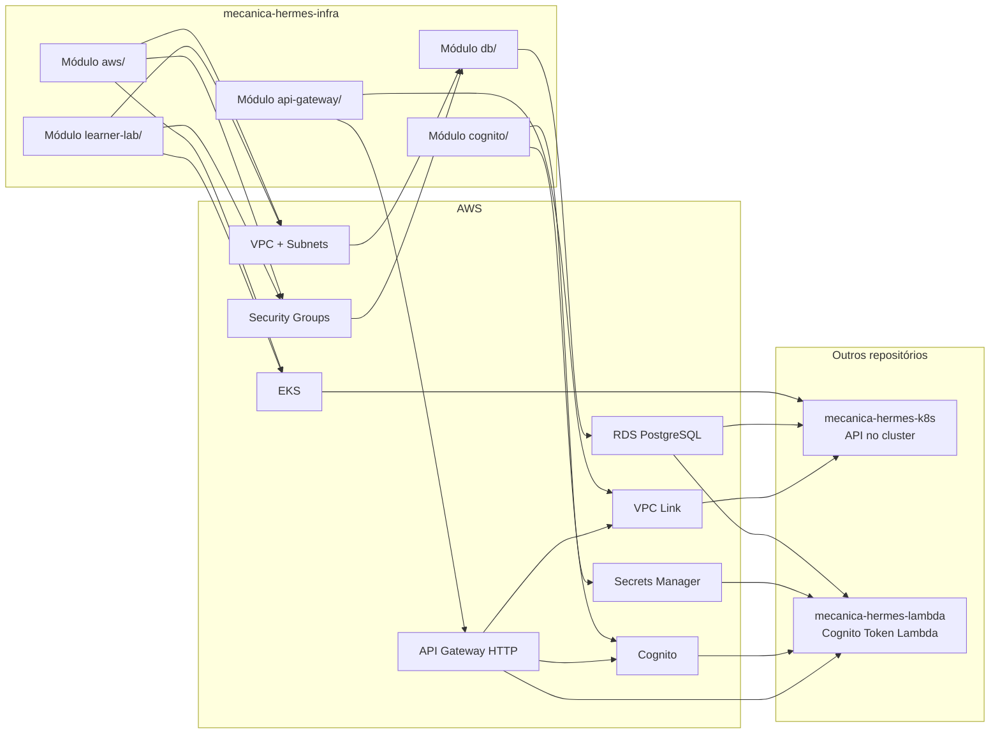

# Arquitetura da Infraestrutura

Este documento descreve a arquitetura provisionada pelo repositório `mecanica-hermes-infra`.

## Escopo do repositório

Este repositório contém cinco módulos Terraform:

- `aws/`: VPC, sub-redes, EKS e security groups base (conta admin).
- `learner-lab/`: mesma infraestrutura base, adaptada para AWS Academy Learner Lab.
- `cognito/`: User Pool, App Client, Resource Server, domínio e secret do Cognito.
- `db/`: RDS PostgreSQL para ambientes HML e PRD.
- `api-gateway/`: API Gateway HTTP, autorizer JWT Cognito e integração com Lambda/NLB.

## Visão arquitetural

## Dependências e ordem de provisionamento

1. Infra base (`aws/`): VPC + EKS + Security Groups.
2. Autenticação (`cognito/`): recursos OAuth2/JWT.
3. Banco (`db/`): RDS PostgreSQL em sub-redes privadas.
4. Aplicação (`mecanica-hermes-k8s`): API e observabilidade no cluster.
5. Lambda (`mecanica-hermes-lambda`): geração de token para clientes.
6. Entrada unificada (`api-gateway/`): roteamento público com autenticação JWT.

## Estado e locking do Terraform

Todos os módulos usam backend remoto S3 com lock em DynamoDB:

- Bucket: `mechermes-tf-state-aws`
- Tabela de lock: `mechermes-tf-locks`
